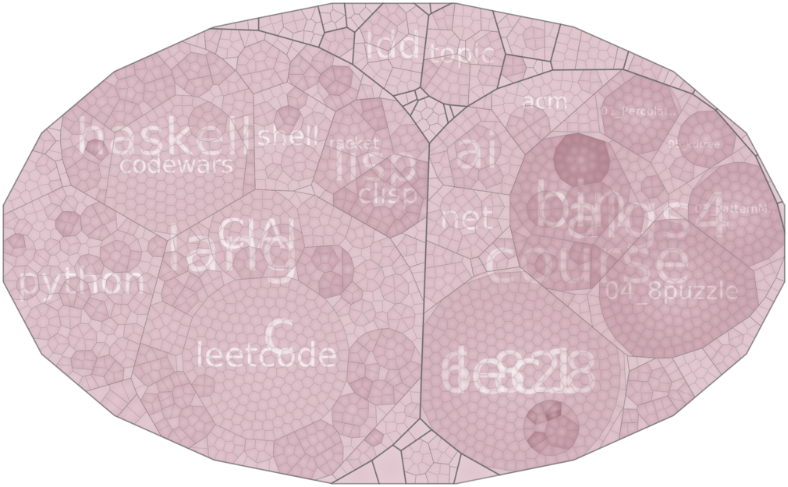

# test
just some test or learning code

## language
### python
* centos_process    display CentOS process figure

### issuse
* doctest           rawstring detail

## compress
* cavlc
* Columbus
* lzw

## visualization
[visualize/Readme.wiki](visualize/Readme.wiki)

## cloc of language

| language | loc | ratio | loc 20171107 |
|----------|-----|-------|--------------|
| C        | 19k |       | 31k          |
| Java     | 6k  |       |              |
| Python   | 5k  |       |              |
| C++      | 3k  |       |              |
| Haskell  | 2K  | 8.2%  | 4k           |
| Lisp     | 841 | 8.4%  |              |
| Erlang   | 445 | 4.5%  |              |
